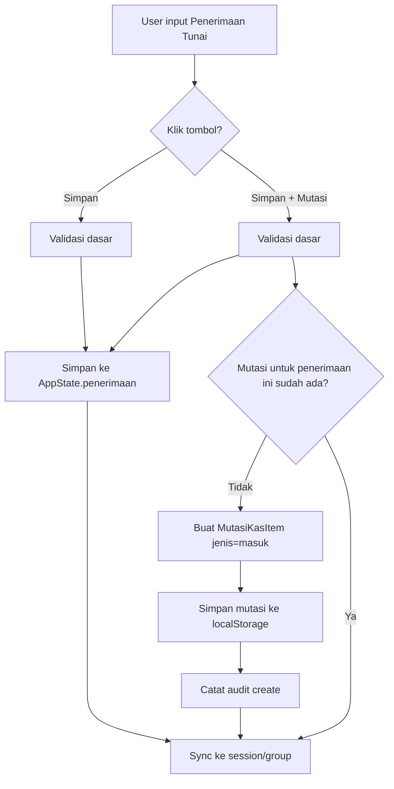

# Penerimaan Tunai → Auto Mutasi Kas

## Ringkasan

Pada modul **Penerimaan Desa (Tunai)**, user dapat:

- **Simpan**: menyimpan transaksi penerimaan tunai tanpa mencatat ke menu Mutasi Kas.
- **Simpan + Mutasi**: menyimpan transaksi penerimaan tunai dan langsung mencatat ke menu Mutasi Kas sebagai transaksi **Masuk (Tunai)**, tanpa dialog konfirmasi tambahan.

Mutasi disimpan di localStorage dan ikut disinkronkan ke mode kelompok (Convex) / sesi individual (Convex) sebagai `mutasiKas` di payload state.

## Data yang Terlibat

### PenerimaanItem (AppState)

- `jenis`: `"tunai" | "bank" | "silpa"`
- `sudahMutasi?: boolean` untuk menandai penerimaan tunai yang sudah diproses menjadi mutasi setor.

### MutasiKasItem (localStorage)

- `jenis`: `"masuk" | "keluar" | "setor" | "ambil"`
- `sumberPenerimaanIds?: string[]` untuk mencegah mutasi ganda pada penerimaan yang sama.
- Audit minimal di item mutasi: `createdAt`, `createdBySessionId`, `createdByName`.

### Audit Trail (localStorage)

Audit trail disimpan di key `siskeudes_mutasi_kas_audit` sebagai list event:

- `action`: `"create" | "delete"`
- `mutasiId`
- `bySessionId`, `byName`
- `mutasi` (snapshot)
- `source` (mis. `{ type: "penerimaan", id: "<penerimaanId>" }`)

## Flowchart Proses

## Validasi & Error Handling

Validasi minimal saat simpan:

- `tanggal` wajib
- `uraian` wajib
- `jumlah > 0` (atau dihitung otomatis dari rincian)

Validasi proses mutasi:

- hanya berlaku untuk tab `jenis="tunai"`
- idempotent: jika mutasi sudah pernah dibuat untuk penerimaan yang sama (dicek via `sumberPenerimaanIds`), tidak dibuat ulang.

Jika proses mutasi gagal (mis. error localStorage), penerimaan tetap tersimpan, namun UI menampilkan error.

## Spesifikasi Endpoint Sync

### Mode Kelompok (Convex)

Mutation yang dipakai:

- `groupStates.merge`

Payload:

- `groupId: string`
- `sessionId: string`
- `state: object` berisi gabungan:
  - AppState (koleksi-koleksi seperti `penerimaan`, `spp`, `pencairan`, dst)
  - `mutasiKas: MutasiKasItem[]`

### Mode Individual (Convex)

Upsert sesi:

- `upsertSession({ form_data: payload })` (diterapkan lewat Convex `sessions.upsert`)

Payload:

- `form_data`: object yang berisi AppState + `mutasiKas`

Catatan:

- Transaksi `jenis="masuk/keluar"` hanya untuk pencatatan transaksi tunai di menu Mutasi Kas.
- Transfer kas↔bank tetap memakai mutasi `jenis="setor/ambil"` dan dipakai engine sebagai transfer internal di neraca.
